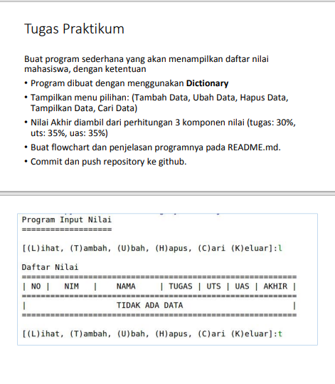
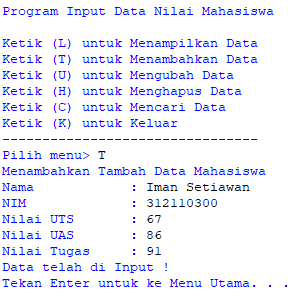
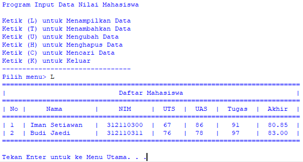
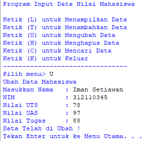
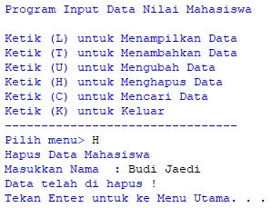
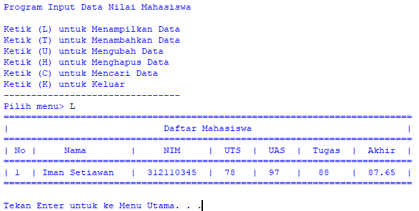
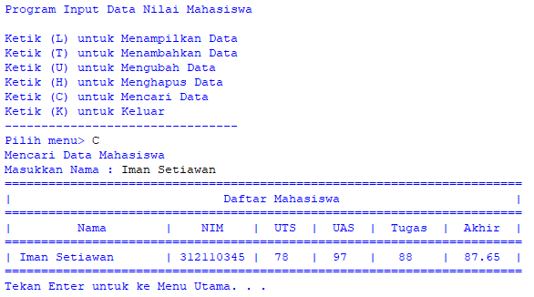

# Iman Setiawan

**Tugas Praktikum - Pertemuan 9**\
**Materi List, Tuple, dan Dictionary**

Berikut soal tugas dari modul.\

Ini adalah flowchart dari program yang akan saya buat.\

Dibawah ini adalah code saya\
Saya menggunakan ekstension PrettyTable pada code saya, yang membuatnya lebih mudah.
~~~

~~~

Contoh menambahkan data.\

Contoh menampilkan Data.\
Dengan input data diri dan nilai-nilai.\

Contoh mengubah data.\
Dengan input data diri dan nilai-nilai.\
\

Contoh menghapus data.\
\

Contoh mencari data.\

